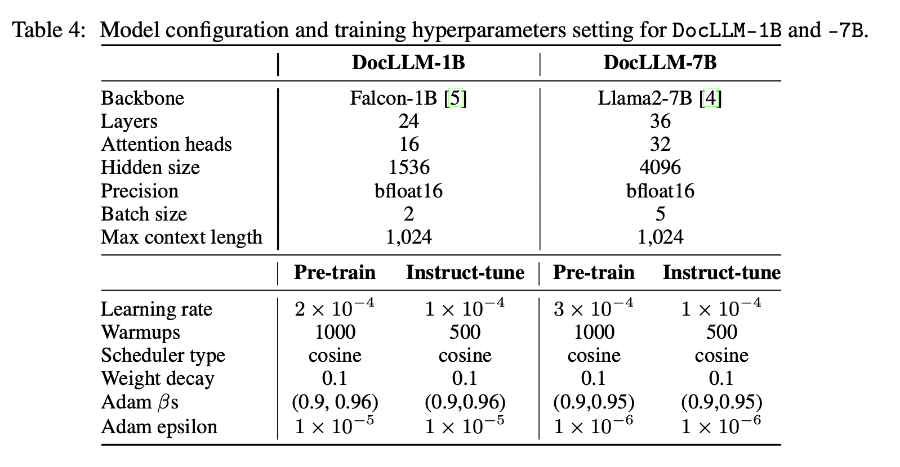

<!-- markdownlint-disable MD013 -->
<!-- markdownlint-disable MD022 -->

# DocLLM: A layout-aware generative language model for multimodal document understanding

Dongsheng Wang, Natraj Raman, Mathieu Sibue, Zhiqiang Ma, Petr Babkin, Simerjot Kaur, Yulong Pei, Armineh Nourbakhsh, Xiaomo Liu

# arXiv Paper

The paper for Doc-LLM can be found here - [Doc-LLM](https://arxiv.org/abs/2401.00908)

# Paper Overview

## Two stage training process

- Pretraining
  - Document is represented into set of text blocks that partitions an input sequence x into non-overlapping contiguous tokens.
    
  - Attention matrix computation into four different scores, namely text-to-text, text-to-spatial, spatial-to-text and spatial-to-spatial.
  - Hidden vectors S are reused across different layers, while each layer retains the flexibility to employ different projection matrices
  - Autoregressive Infilling - Fill in the midddle
    > `[PRE] prefix [SUF] suffix [MID] middle`

### Architecture

- Instruction fine tuning

## Doc AI tasks

- Visual question answering (VQA)
- Natural Language inference (NLI)
- Key information extraction (KIE)
- Document classification (CLS)

## Model sizes

1. DocLLM-1B 
2. DocLLM-7B

## Configuration

1. The maximum sequence length, or context length, is consistently set to 1,024 for both versions during the entire training process. 

2. The DocLLM-7B models are trained with 16-bit mixed precision on 8 24GB A10g GPUs using fully sharded data parallelism, implemented with the accelerate library.

3. The DocLLM-1B model, on the other hand, is trained on a single 24GB A10g GPU.

 

# References

https://huggingface.co/papers/2401.00908  
https://medium.com/@basics.machinelearning/discover-docllm-the-new-llm-from-jpmorgan-for-working-with-complex-documents-5f54ea287d52  
