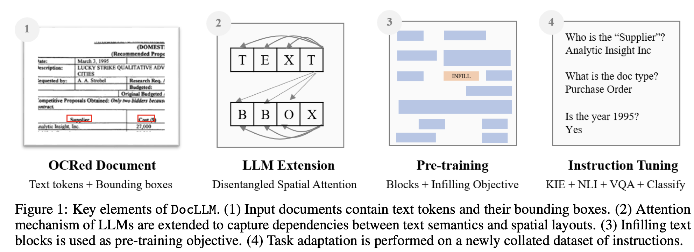
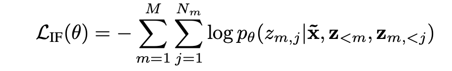
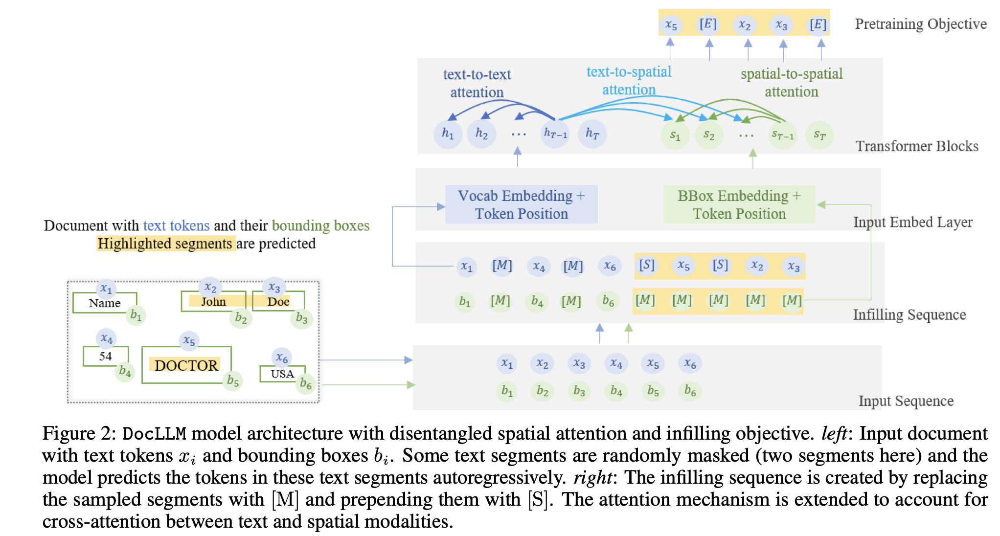
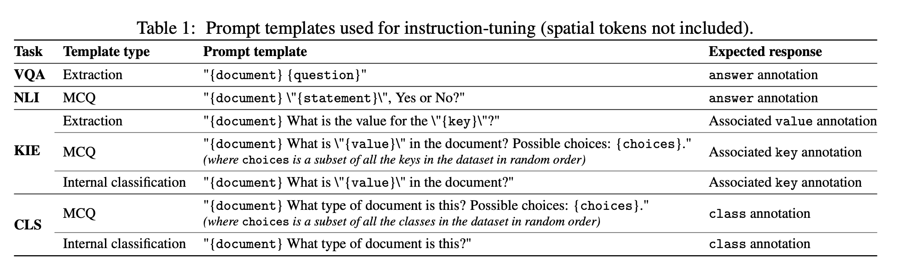
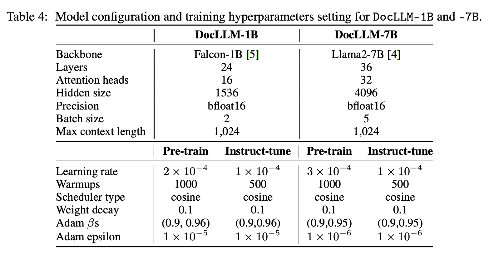

<!-- markdownlint-disable MD013 -->
<!-- markdownlint-disable MD022 -->
# DocLLM

## Two stage training process

- Pretraining
  - Document is represented into set of text blocks that partitions an input sequence x into non-overlapping contiguous tokens.

  - Attention matrix computation into four different scores, namely text-to-text, text-to-spatial, spatial-to-text and spatial-to-spatial.
  - Hidden vectors S are reused across different layers, while each layer retains the flexibility to employ different projection matrices
  - Autoregressive Infilling - Fill in the midddle
  > `[PRE] prefix [SUF] suffix [MID] middle`

- Instruction fine tuning

## Doc AI tasks

- Visual question answering (VQA)
- Natural Language inference (NLI)
- Key information extraction (KIE)
- Document classification (CLS)

## Model sizes

- DocLLM-1B
- DocLLM-7B

## Configuration
> The maximum sequence length, or context length, is consistently set to 1,024 for both versions during the entire training process. The DocLLM-7B models are trained with 16-bit mixed precision on 8 24GB A10g GPUs using fully sharded data parallelism, implemented with the accelerate library.4 The DocLLM-1B model, on the other hand, is trained on a single 24GB A10g GPU.

